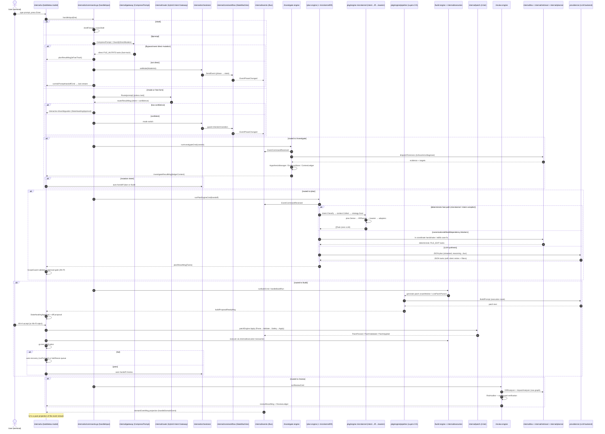

# IZEN System Architecture — As-Built Reference

> **Document type:** Codebase archaeology / as-built architecture.
> **Source of truth:** The repository on disk (verified against `.go` sources).
> **Scope:** `cmd/izen`, `internal/**`, `pkg/**`. This document reflects **only what exists in the codebase** — no idealized assumptions.
>
> All file references are relative to the repository root and correspond to real files. Generated by static analysis of 729 Go files.

---

## Table of Contents

1. [Executive System Overview](#1-executive-system-overview)
2. [Core Architecture & Component Map](#2-core-architecture--component-map)
3. [End-to-End Execution Flow: From Prompt to Patch](#3-end-to-end-execution-flow-from-prompt-to-patch)
4. [Data Structures & State Transformation Reference](#4-data-structures--state-transformation-reference)
5. [Current Architectural Gaps & Debt](#5-current-architectural-gaps--debt)

---

## 1. Executive System Overview

Izen ("human-centered coding intelligence") is a **headless, event-driven coding agent** with a Bubble Tea TUI. The defining architectural rule is stated in `internal/events/events.go`:

> "Engines are headless: they publish `DomainEvents` and never call UI update routines, log sinks, or terminal printers directly. The UI, logging, and state tracking layers subscribe to the bus and act purely as projections of the event stream."

The system is split into **several parallel engine generations** that coexist today:

| Generation | Location | Role | State machine |
|---|---|---|---|
| **Mode engines (v0, "the modes")** | `internal/modes/*` | Per-mode command execution: `/plan`, `/build`, `/investigate`, `/review`, `/commit`, `/undo` | Per-mode stage machines + `internal/core/workflow` |
| **Layered Pipeline Engine (v1, "Layers 0–5")** | `pkg/engine/pipeline` + `pkg/engine/layer0..layer4` + `pkg/engine/telemetry` | Deterministic knowledge → capability → context → execution → validation pipeline with intent-based model routing | `pkg/engine/ir` Static/Dynamic IR + `pkg/engine/decision` |
| **Izen Agent Runtime V3 (CLI `izen run`)** | `pkg/app` + `pkg/kernel` + `pkg/event` + `pkg/resource` + `pkg/capability` + `pkg/extractor` + `pkg/ir` + `pkg/op` + `pkg/graph` + `pkg/planner` | Three-layer runtime: **Language Layer** (capability-constrained generation → evidence-based extraction → `ir.Artifact`) → **Planning Layer** (`GreenfieldPlanner`/`BrownfieldPlanner` → `op.Operation` → `graph.ExecutionGraph`) → **Runtime Layer** (`kernel.Engine` task lifecycle + `resource` adapters, side-effects on `pkg/event`) | `pkg/kernel` `ExecutionStatus` (pending → running → completed/failed/canceled) |
| **Microkernel intent compiler** | `pkg/engine/{intent,context,strategy,plan,ir/logical,lowerer,adapter,inference}` | Deterministic prompt → Logical IR → framework-specific FileArtifacts, zero LLM | — (pure transformations) |
| **Control plane (core)** | `internal/core/*` | Workflow state machine, artifact store, capability set, mutation budget, authorization, failure classifier | `internal/core/workflow/machine.go` |

The **UI (`internal/ui`)** is a pure projection: it constructs the engines at bootstrap (`internal/ui/program.go`), routes keystrokes into them, and renders whatever the **event bus** (`internal/events`) and the **presentation bridge** (`internal/presentation`) deliver. Engines never import `internal/ui`.

The **Application layer** (`internal/runtime/compose`) is the single composition root: it wires the domain `WorkflowRuntime`, command handlers, a ledger projection and the `Runtime` facade onto one shared event bus, then injects that `Application` into the presentation layer. `cmd/izen/main.go` is the process entry point; `internal/runtime/compose/compose.go:Wire` is the composition root of the Application layer.

### The headless event bus is the backbone

- `internal/events/bus.go` — thread-safe, non-blocking pub/sub. Each subscription owns a buffered channel (default 256, `events.DefaultBufferSize`) drained by its own goroutine. `Publish` never blocks; slow consumers drop events (counted on `Subscription.Dropped()`).
- 20+ typed domain events are defined in `internal/events/events.go`, including the lifecycle core: `EventCommandReceived`, `EventIntentParsed`, `EventPlanStaged`, `EventPatchAttempted`, `EventPatchApplied`, `EventExecutionFailed` (with mandatory `FailureClassification`), `EventStageCompleted`.
- A second, engine-internal telemetry bus exists in `pkg/engine/telemetry` (`EventBus`, non-blocking, channel-backed) for the Layer 0–5 pipeline events (`layer0.knowledge_resolved`, `layer1.capability_detected`, `layer2.context_governed`, `layer3.pipeline_step`, `layer4.validation_dag`, `control.iteration`, `control.node_observed`, `control.terminated`).

---

## 2. Core Architecture & Component Map

### 2.1 Process entry & bootstrap (`cmd/izen`)

**`cmd/izen/main.go`** — `main()`:

1. **Phase 1 — global subcommand dispatch** (no local state): `version`, `help`, `auth login` (stub), `stats` (stub), `config style <policy>`, `compact`/`memory optimize`, `debug [path]`, `run "<prompt>"`.
2. **Phase 2 — local scope parsing**: `rollback` mode or a target directory argument.
3. **Bootstrap common infrastructure**: `config.Load()` → `cfg.Validate()` → `prompt.SetActiveStyle(cfg.ActiveStylePolicy())`; silent `~/.izen/` global init (`state.InitGlobalState`).
4. **Composition root**: instantiate infrastructure adapters `capabilities.NewOSFile(root)`, `NewExecShell(30s)`, `NewGitCLI(root)`, `NewPatchAdapter(root)`, and the shared `events.NewBus(...)`; then `compose.Wire(...)` to build the Application layer.
5. `state.MigrateLegacyFiles(root)` + `state.CheckVersion(root, Version)`.
6. **Onboarding gate**: if `.izen/config.json` is missing, launch the TUI directly into onboarding (`ui.RunMainDashboardWithApp`). Never writes `.izen/` from `main.go`.
7. `project.Detect(root)` → logs primary/secondary languages.
8. **TUI boot routing**: `ui.RunRollbackEngine` (rollback mode) or `ui.RunMainDashboardWithApp`.

**`cmd/izen/runtime.go`** — `izen run "<prompt>"`: routes the prompt through the **V3 pipeline** (`pkg/app`). It builds a pipeline via `app.NewPipeline(...)` (`pkg/app/pipeline.go`) with a `cliGenerator` adapting the configured `ai.Provider` to the `app.Generator` contract, subscribes `app.StatusLine` (`pkg/app/status.go`) to the pipeline's `pkg/event` bus for terminal status output, and prints the V3 audit trail — capabilities, extraction attempts, artifact validations, planner metadata, and kernel task event counts.

### 2.2 Application layer & Runtime facade (`internal/runtime`)

**`internal/runtime/compose/compose.go`** — `Wire(opts ...Option) (*Application, error)`:

- Creates the shared `events.Bus` (or accepts `WithBus`).
- Builds `workflow.NewWorkflowRuntime()` (domain WorkflowRuntime).
- `runtime.NewCommandDispatcher()` + `handlers.New(...)` registers **every canonical command handler** onto the dispatcher.
- `runtime.NewLedgerBuilder(bus)` starts a projection; `builder.Ledger()` exposes the `ContextLedger`.
- `runtime.NewRuntime(dispatcher, WithEventBus(bus))` — the thin **Runtime facade**.

**`internal/runtime/runtime.go`** — `Runtime.Execute(ctx, cmd)` routes a `RuntimeCommand` to the dispatcher and publishes `EventCommandReceived`; `Runtime.Start()` subscribes an `EventTranslator` to the domain bus and fans translated `PresentationEvent`s to registered presentation listeners (`SubscribePresentation`).

Supporting files: `internal/runtime/command.go` (command types), `internal/runtime/dispatcher.go`, `internal/runtime/event_translator.go` (domain → presentation), `internal/runtime/ledger_builder.go` (ContextLedger projection), `internal/runtime/handlers/handlers.go` (approval + workflow command handlers), `internal/runtime/output/` (command-output pipeline: `output.go`, `compressor.go`, `classify.go`, `normalize.go`, `tee.go`).

### 2.3 Core control plane (`internal/core`)

| Package | Responsibility | Key types |
|---|---|---|
| `internal/core/workflow` | Canonical workflow state machine | `WorkflowState` (Idle/Investigating/Planning/Building/Reviewing/Repairing/Verified/Failed), `WorkflowEvent` (Investigate/Plan/Build/Review/FailureIdentified/VerificationPassed/Reset), guarded transitions (`machine.go`), `CheckpointCoordinator` |
| `internal/core/artifact` | Artifact lifecycle (Intent → Evidence → Plan → Patch → Review) | `ArtifactKind`, `ArtifactID <kind>_<ULID>`, `BaseArtifact`, `LifecycleState`, `Store`, `LifecycleTransitionValidator` |
| `internal/core/capability` | Permission bits | `CapabilitySet`, `CapabilityRead/Write/Execute/Test/Patch/Checkpoint/Rollback` |
| `internal/core/budget` | Resource budgets | `MutationBudget` (files/diffs/tokens/attempts/duration/concurrency), `MicroBudget` |
| `internal/core/authorization` | Mutation authorization | `AuthorizationEngine`, `ProductionAuthorizationEngine` |
| `internal/core/classifier` | Failure taxonomy | `FailureClass` (Code/Environment/Test/Scope/Unknown), `FailureClassifier` (regex matchers) |
| `internal/core/runtime` | Persistent per-workspace context | `RuntimeContext` (artifact store + capability set + budget + snapshot/capability registry) |
| `internal/core/stream` | SSE stream primitives | `RuneBuffer`, `Splitter`, `Classifier` (content vs reasoning frames) |
| `internal/core/contract` | Domain contracts | `contract.go` |

### 2.4 Mode engines (`internal/modes`)

**`internal/modes/modes.go`** — `Mode` enum (Ask/Plan/Build/Investigate/Review) with a **capability matrix** (Read/Write/Shell/Test/Patch/Checkpoint) and the prefix-based `Resolver` (`/ask`, `/plan`, `/build`, `/investigate`, `/review`).

| Engine | File(s) | Stage/state machine | Key behaviors |
|---|---|---|---|
| **plan** | `internal/modes/plan/engine.go`, `planner.go`, `checklist.go`, `intentcompiler.go`, `microkernel.go`, `schema.go`, `truncate.go` | Implicit (JSON synthesis retry loop + fast paths) | `ProcessFromLedger`: deterministic fast paths (direct mutation, canonical-import mismatch via lx, undefined-symbol stdlib case fix, REMOTE DEPENDENCY BLOCKER) then LLM JSON-plan synthesis with 2 silent retries, anti-hallucination filters, tolerant markdown fallback. `MicrokernelPlanner` + `IntentCompilerPlanner` are zero-LLM deterministic primes. |
| **build** | `internal/modes/build/engine.go`, `executor.go`, `stage.go`, `recovery.go`, `summary.go` | `BuildRecoveryState` (None/FirstPatch/ForceRewrite) | `Proposal` queue + **7-Layer Guardrail** (`ErrHumanValidationRequired`): no mutation is applied without explicit human approval (`QueueProposal`/`ApproveProposal`/`IsApprovedByFile`). Tracks compilation failures for auto-recovery. |
| **investigate** | `internal/modes/investigate/engine.go`, `state.go`, `hypothesis.go`, `evidence.go`, `dispatcher.go`, `toolrunner.go`, `testloop.go`, `proximity.go`, `target.go`, `adapter.go` | `StateObserve → Hypothesize → Search → Gather → Evaluate → Narrow → Verify → Propose → Done` | Forensics via AI/heuristic `DispatchStrategy` + `ToolRunner` (lx/trace/env/diagnose), `HypothesisManager`, `EvidenceStore`, `ProximitySlicer`, `TestLoop`, `ContextLedger`. Short-circuits mutation intents to `/plan` or `/build`. Injects `REMOTE DEPENDENCY BLOCKER` tokens. |
| **review** | `internal/modes/review/engine.go`, `diff.go`, `impact.go`, `risk.go`, `state.go`, `types.go` | `StateCollect → AnalyzeDiff → ImpactRadius → RiskAudit → Verify → Report → Done` | Git-diff analysis, `ImpactAnalyzer` (Lea graph), `RiskAuditor`, sandboxed deterministic verification (writes + runs `_test.go` in a temp sandbox), `ReviewLedger` with C-R-H-V-E evidence chain. |
| **commit** | `internal/modes/commit/engine.go`, `executor.go` | — | Commit message generation + execution |
| **undo** | `internal/modes/undo/handler.go` | — | Rollback handler |

Every mode engine is **headless**: `WithEventBus(bus)` + a private `emit(ev events.DomainEvent)` that is a strict no-op when no bus is wired.

### 2.5 Layered Pipeline Engine (Layers 0–5, `pkg/engine`)

**`pkg/engine/pipeline/engine.go`** — `Engine` (wired over a `lea.Engine` System of Record). `Run(ctx, Request)` executes the canonical six-step pipeline:

1. **Layer 0 — Knowledge resolution** (`pkg/engine/layer0/resolver.go`): `KnowledgeResolver.Resolve()` → `ResolvedKnowledge` (managers, lockfiles, file tree, AGENTS.md/CLAUDE.md/.cursorrules, project docs, README, active conventions, structural constraints, conflicts). Priority: RuntimeFacts(1) > AgentRules(2) > ProjectDocs(3) > HumanReads(4).
2. **Layer 1 — Capability detection** (`pkg/engine/layer1/detect.go`, `graph.go`): `layer1.Detect(root)` → `Graph` (stack + toolchain capability → command mapping). `CapabilityHeader(g)` (`pkg/engine/pipeline/header.go`) injects the stack into every LLM system prompt.
3. **Layer 2 — Governed context** (`pkg/engine/layer2/sor.go`, `governor.go`): `Sor` facade over the Lea graph → `ContextGovernor.Build(req, policy)` → immutable `ExecutionContext` (files, symbols, imports, token-budgeted stats).
4. **Layer 3 — Execution** (`pkg/engine/layer3/`): `PolicyGuard` routes each request to `RouteASTRewrite` or `RouteGenerative`; `Pipeline` runs `Understand → Plan → Execute → Review → Validate`; generative path uses a `Worker` (`routeWorker` in `pkg/engine/pipeline/engine.go`) that builds the prompt via `layer3.BuildPrompt` and parses patches via `layer3.LinePatchParser`; deterministic path uses `ASTRewriteHandler`. Stage transitions are published to the telemetry bus.
5. **Layer 4 — Validation DAG** (`pkg/engine/layer4/`): `DAG` executes `StageStructural` (SoR-based `StructuralValidator`) → `StageSyntax` (`SyntaxValidator`) always; `StageLint`/`StageBuild`/`StageTest` when `ValidationCapability` mode and the workspace capability graph exposes them.
6. **Layer 5 — Telemetry** (`pkg/engine/telemetry/`): every layer publishes to a non-blocking `EventBus`; `Timeline` records one request's ordered event stream; `StrategyOptimizer` folds pass rates back into policy recommendations.

The engine also exposes `RouteForMode(mode)` via the **intent-based model router** (`pkg/engine/pipeline/router.go`): `RouteProfile{Intent, Model, Provider, Policy, Reason}` with default per-intent Layer 2 budgets — `IntentReasoning` (24k tokens / 20 files / 1024 symbols), `IntentExecution` (16k / 16 / 512), `IntentInformational` (8k / 8 / 256).

### 2.6 Microkernel intent compiler (`pkg/engine` subpackages)

A pure, deterministic, zero-LLM compile pipeline for greenfield/framework generation:

```
intent.Classify (pkg/engine/intent/classify.go)
  → context.Collect (pkg/engine/context/collector.go)      [PlanningContext]
  → strategy.DetermineGoal (pkg/engine/strategy/*.go)      [Goal]
  → planner.Derive (pkg/engine/plan/planner.go)            [LogicalPlan of Steps]
  → normalizer/validator/policyEngine (pkg/engine/plan/*)  [Normalized → Validated]
  → IRPlanner (pkg/engine/planner/irplanner.go)            [Logical IR nodes]
  → lowerer.PlanLowerer (pkg/engine/lowerer/lowerer.go)    [Framework+Capability → MappedNode]
  → adapter.RenderNode (pkg/engine/adapter/*.go)           [FileArtifact]
```

- **Intent**: `Family` (Greenfield/Feature/BugFix/Refactor/Architecture/Question/General) + `Facet` (Mutates/ReadOnly/RunsTools/RequiresTest/Exploratory/HighRisk), classified by deterministic keyword signals (`classify.go`).
- **Inference**: `InferenceEngine.Infer(facts, slots)` → `InferenceSet` across 4 dimensions (Framework/Language/Styling/Router); `PolicyEngine.Evaluate` → `DecisionProceed | DecisionFallback | DecisionEscalateToHuman` with confidence (0.45) and delta (0.15) thresholds.
- **Static/Dynamic IR**: `pkg/engine/ir/graph.go` (immutable `ExecutionGraph`/`ExecutionNode`/`Plan`) + `pkg/engine/ir/snapshot.go` (mutable `ExecutionSnapshot`, `NodeState`, `ObservationPayload`). `pkg/engine/decision/engine.go` (`StandardDecisionEngine`) is the *only* consumer of the Dynamic IR and emits `DirectiveContinue/Retry/RePlan/HumanApproval/Abort`.
- **Adapters** (`pkg/engine/adapter/`): pure renderers for `FrameworkNextJS`, `FrameworkAstro`, `FrameworkReactVite`, `FrameworkGoGin`, `FrameworkStaticWeb` (files `nextjs.go`, `astro.go`, `reactvite.go`, `gogin.go`, `staticweb.go`).

### 2.7 Izen Agent Runtime V3 (`pkg/app`, `pkg/kernel`, `pkg/event`, `pkg/resource`, `pkg/capability`, `pkg/extractor`, `pkg/op`, `pkg/graph`, `pkg/planner`)

The **Agent Runtime V3** is the current, fully integrated runtime behind the CLI `izen run`. It is organized as a strict **three-layer pipeline** in which each layer is deliberately free of AI/LLM, I/O and prompt dependencies — the LLM is confined to the Language Layer's generation call, and all side effects are dispatched exclusively through the `pkg/event` bus and the `pkg/resource` adapters.

```
Language Layer                          Planning Layer                  Runtime Layer
─────────────                           ─────────────                  ─────────────
pkg/capability                          pkg/planner                    pkg/kernel
  Registry → intent capability set       GreenfieldPlanner  ─┐          Engine (task lifecycle,
  Semantic constraints (Validate)        BrownfieldPlanner  ─┤           timeout, classification)
pkg/extractor                            pkg/op                        pkg/resource
  MarkdownFence / JSON extractors          Operation IR (op.file.write,  file / git / terminal
  EvidenceFlags → deterministic accept     op.exec.cmd, op.git.commit)     adapters
pkg/ir                                  pkg/graph                      pkg/event
  ir.Artifact (path, kind, SHA-256)       ExecutionGraph (DAG,          MemoryEventBus
                                          InjectRepairOps)               task.* events
```

- **Language Layer — `pkg/capability` + `pkg/extractor` + `pkg/ir`**: `capability.Registry` (`pkg/capability/registry.go`) stores and resolves `Capability` instances — each capability owns its own model-tier-aware `PromptRepresentation` and its `Validate(ctx, data) ValidationResult` (`pkg/capability/capability.go`), so the registry never interprets semantics. Built-in semantic capabilities (`pkg/capability/defaults.go`) — `portfolio_website`, `semantic_html`, `typescript`, `go_backend`, `generic_code` — constrain generation and gate artifacts. `pkg/extractor` turns raw LLM output into canonical `ir.Artifact` values via `MarkdownFenceExtractor` (` ```lang:path`, ` ```lang path`, `=== FILE: path`) and `JSONExtractor` (envelope schema); acceptance is a **pure function of `EvidenceFlag`s** (`EvValidFenceHeader`, `EvPathInHeader`, `EvFenceClosed`, `EvValidUTF8`, `EvValidJSONSchema`) — never a confidence score (`pkg/extractor/evidence.go`). `pkg/ir` (`pkg/ir/artifact.go`) is the dependency-free Artifact IR: `ArtifactKind` (file/symlink/meta), `NewArtifact` computes a deterministic SHA-256 `Hash`, and `ComputeHash` is the identity contract between extraction and validation.
- **Planning Layer — `pkg/op` + `pkg/graph` + `pkg/planner`**: `op.Operation` (`pkg/op/op.go`) is the declarative Operation IR — a typed, target-resource-bound unit (`op.file.write`, `op.file.delete`, `op.exec.cmd`, `op.git.commit`) with `Preconditions` and `Timeout`, validated at construction; it never mutates a target directly. `graph.ExecutionGraph` (`pkg/graph/graph.go`) is a thread-safe DAG of `OpNode`s run on the kernel engine, with runtime mutation via `InjectRepairOps` (inserts repair operations on a node failure and rewires downstream dependencies). `pkg/planner` exposes the `Planner` contract (`Plan(ctx, intent, artifacts) *PlanResult`); `GreenfieldPlanner` (`pkg/planner/greenfield`) deterministically lowers every file artifact into a parallel/topological batch of `OpWriteFile` writes (zero tool calls), while `BrownfieldPlanner` (`pkg/planner/brownfield`) builds an edit-and-verify graph (`bf-write` → `bf-verify` compile/test node) and runs the closed-loop `ExecuteAndRepair` — analyzing failure output into `FailureReport`/`FailureSymptom` and injecting repair ops until green or the repair budget is exhausted.
- **Runtime Layer — `pkg/kernel` + `pkg/event` + `pkg/resource`**: `kernel.Engine` (`pkg/kernel/engine.go`) executes `Executable` tasks with a task-scoped context, per-task `Timeout`, and deterministic terminal classification (`StatusCompleted`/`StatusFailed`/`StatusCanceled`) from cancellation cause / deadline / explicit runtime cancel (`pkg/kernel/status.go`, `runtime.go`). `pkg/event` is the dependency-free runtime event model (`task.started`, `task.completed`, `task.failed`, `task.canceled`, `budget.exceeded`, `state.checkpoint`); `MemoryEventBus` (`pkg/event/bus.go`) is a thread-safe, non-blocking pub/sub — each subscription owns a buffered channel drained by its own goroutine, and `Publish` never blocks (slow observers drop events). `pkg/resource` (`pkg/resource/resource.go`) is the **Resource Target Inversion** abstraction: `Resource` exposes `ValidateState` / `Snapshot` / `Restore` over `file`, `git` and `terminal` adapters, so the graph and kernel interact with target state through one deterministic interface and never touch a file, process or repository directly.
- **`pkg/app`** (`pkg/app/pipeline.go`) is the integration seam that wires the three layers into a single callable `Pipeline` (`app.NewPipeline(...)`, options `WithRegistry`/`WithExtractors`/`WithGenerator`/`WithEventBus`/`WithRoot`/`WithMode`/`WithMaxAttempts`/`WithMaxRepairs`). `Run` routes a prompt through capability resolution → system prompt → generation → evidence-based extraction (rejected extractions re-prompt with the evidence payload) → validation gate (failed artifacts re-prompt with rejection reasons) → `plan()` (auto greenfield/brownfield detection; parent dirs created only after the gate) → `execute()` on `kernel.NewEngine(p.bus)`. `app.StatusLine` renders kernel events as compact status lines for terminal observers.

### 2.8 Retrieval, structural index, context planner, patch

- **`internal/lea`** — the **Lea structural engine**: indexes the workspace into an in-memory graph (persisted `.izen/graph.bin.zst`). Backs `/arch`, the context planner's graph source, and the retrieval graph tier. (`engine.go`, `store.go`, `graph/`, `query.go`, `watch.go`, `gitsync.go`, `codec.go`).
- **`internal/retrieval`** — search router (`router.go`), native fallback (`native.go`), optional lx daemon adapter (`lynx_adapter.go`), fulltext (`fulltext/`), symbol extractors (`symbol/`), `canonical.go` (canonical-import-mismatch + undefined-symbol parsers and the **LX coordinate handshake**), orchestrator + polyglot engine.
- **`internal/planner`** — intent-aware **Context Planner**: `Planner.Plan(input)` classifies intent (BUG_FIX/ARCHITECTURE/REFACTOR/EXPLANATION/GENERAL), allocates a token budget across sources (log/call_tree/graph/architecture/file), gathers budget-fitted chunks from adapters (`NewLeaAdapter`, `NewGraphAdapter`, `NewRetrievalFileAdapter`, `NewTeeLogAdapter`), and renders `ContextPlan.Assemble()`.
- **`internal/patch`** — the **4-tier patch pipeline**: `TieredParser` (Tier1 structured diff → Tier2 SEARCH/REPLACE → Tier3 whole-file → Tier4 human approval), `StructuralValidator`, `ContextualSafetyEvaluator`, `FileApplicator`. `Engine.Apply` = Parse → Validate → Safety → Apply, emitting `PatchParsed/PatchValidated/PatchRejected/ApprovalRequested` on the bus.
- **`internal/execution`** — transaction-based build executor (`execution.go`, `patch.go`, `guardrail.go`, `verify.go`, `toolcalls.go`, `test.go`), `ToolCallBuffer` for native tool-call interception.

### 2.9 System prompts, providers, LLM plumbing

- **`internal/prompt`** — prompt factories: `AskContract`, `PlanSynthesisSystemPrompt`, `PlanDirectMutationSystemPrompt`, `BuildContract`, `NewFileContract`, `ExistingFileContract`, `StrategyContract`, schemas (`PlanTaskSchema`, `PlanSynthesisSchema`), style policy, workspace capability header injection (`SetWorkspaceCapabilities`), grounded constraints.
- **`internal/ai`** — `Provider` interface, `Request`/`Response`, `Manager`.
- **`internal/providers`** — `OllamaProvider`, `OpenRouterProvider`, `OpenAIProvider`, `ClaudeProvider`, `GeminiProvider`, `GroqProvider`, `OpenCodeProvider`, `NineRouterProvider`.
- **`internal/llm`** — LLM registry, provider adapters, reasoning publisher, cost calculator.
- **`internal/gateway`** — prompt compressor (`CompressPrompt` → `BypassInvest` fast-track), casual-chat detection (`IsCasualChat`), router, squeezer.
- **`internal/stream`** — `Splitter`/`Classifier` used by plan-stream accumulation to separate reasoning from content.

### 2.10 Component relationship diagram

```mermaid
flowchart TB
    subgraph Boot["Process entry — cmd/izen"]
        MAIN["cmd/izen/main.go"] --> WIRE["internal/runtime/compose/compose.go:Wire()"]
        RUN["cmd/izen/runtime.go (izen run)"] --> APPP["pkg/app: NewPipeline + Run"]
    end

    subgraph V3["Agent Runtime V3 — pkg/* (Language → Planning → Runtime)"]
        CAP["pkg/capability — Registry / semantics"]
        EXTR["pkg/extractor — EvidenceFlags → ir.Artifact"]
        PLAN3["pkg/planner — GreenfieldPlanner / BrownfieldPlanner"]
        OP["pkg/op — Operation IR"]
        GEX["pkg/graph — ExecutionGraph / InjectRepairOps"]
        KERN["pkg/kernel — Engine / task lifecycle"]
        RES["pkg/resource — file / git / terminal adapters"]
        EVBUS3["pkg/event — MemoryEventBus"]
        APPP --> CAP
        APPP --> EXTR
        APPP --> PLAN3
        PLAN3 --> OP
        OP --> GEX
        GEX --> KERN
        KERN --> RES
        KERN --> EVBUS3
    end

    WIRE --> BUS["internal/events: Bus (non-blocking pub/sub)"]
    WIRE --> APP["internal/runtime: Application{Runtime, Ledger, Workflow, Bus}"]
    APP --> RT["internal/runtime: Runtime facade"]

    subgraph UI["Presentation layer — internal/ui (pure projection)"]
        PROG["program.go — constructs everything"] 
        MODEL["model.go — bubbletea model"]
        UPDATE["update.go — message routing"]
        COMMANDS["commands.go — handleInput / dispatch"]
        BRIDGE["presentation/bridge.go + runtime_bridge.go"]
        PROJ["handleDomainEvent — bus → activity tree"]
    end

    subgraph ENGINES["Mode engines — internal/modes (headless)"]
        PLAN["plan/engine.go — ProcessFromLedger"]
        BUILD["build/engine.go — Proposal guardrail"]
        INV["investigate/engine.go — forensic state machine"]
        REV["review/engine.go — C-R-H-V-E review"]
        COMMIT["commit / undo"]
    end

    subgraph MICRO["Microkernel intent compiler — pkg/engine"]
        INTENT["intent/classify.go"]
        CTX["context/collector.go"]
        STRAT["strategy/*.go → Goal"]
        IRPLAN["plan/planner.go + planner/irplanner.go"]
        INFER["inference + policy"]
        LOWER["lowerer + adapter/*.go → FileArtifact"]
    end

    subgraph PIPE["Layered Pipeline Engine — pkg/engine/pipeline"]
        L0["layer0 KnowledgeResolver"]
        L1["layer1 Detect / Graph"]
        L2["layer2 Sor / ContextGovernor"]
        L3["layer3 Pipeline / PolicyGuard / Worker"]
        L4["layer4 Validation DAG"]
        L5["telemetry EventBus / Timeline"]
    end

    subgraph CORE["Control plane — internal/core"]
        WFSM["workflow/machine.go — WorkflowStateMachine"]
        ART["artifact Store"]
        AUTH["authorization"]
        BUDGET["budget"]
        CAPS["capability"]
        CLS["classifier — FailureClass"]
    end

    subgraph INFRA["Infrastructure"]
        LEA["internal/lea — structural graph"]
        RETR["internal/retrieval — router / lx / fulltext"]
        PLANR["internal/planner — Context Planner"]
        PATCH["internal/patch — 4-tier pipeline"]
        EXEC["internal/execution — transactions"]
        PROV["internal/providers + internal/ai — LLM backends"]
        PROMPT["internal/prompt — system prompts"]
    end

    ORCH["internal/orchestrator — phase → WorkflowStateMachine"]

    PROG --> BUS
    PROG --> APP
    PROG --> ORCH
    PROG --> ENGINES
    PROG --> MICRO
    PROG --> PIPE
    PROG --> INFRA
    MODEL --> UPDATE
    UPDATE --> COMMANDS
    COMMANDS --> ENGINES
    COMMANDS --> ORCH
    COMMANDS --> BUS
    BUS --> PROJ
    RT --> BUS

    ORCH --> WFSM
    ENGINES --> BUS
    ENGINES --> RETR
    ENGINES --> PATCH
    ENGINES --> PLANR
    ENGINES --> MICRO
    ENGINES --> PROMPT
    ENGINES --> PROV

    PIPE --> L0
    PIPE --> L1
    PIPE --> L2
    PIPE --> L3
    PIPE --> L4
    PIPE --> L5
    L2 --> LEA
    L3 --> PROV
    L4 --> L1

    MICRO --> INFER
    MICRO --> LOWER

    PLANR --> LEA
    PLANR --> RETR
    PATCH --> BUS
    EXEC --> PATCH
    WFSM --> ART
    WFSM --> CLS
```



---

## 3. End-to-End Execution Flow: From Prompt to Patch

### 3.1 The path of a prompt, step by step (as built)

All paths begin at the Bubble Tea `model.Update` loop. `Enter` on the focused `textinput` (`m.ti`) routes to **`internal/ui/commands.go:handleInput(line)`**.

**Step 1 — User ingress & dispatch (`commands.go:134`)**

`handleInput` classifies the line in strict order:

1. `!cmd` → shell firewall (`m.shellFirewall`) → `execShell` (mode `CapShell` gate).
2. `/review $test` composite shortcut.
3. `$prompt` → **global mode-guard router to `/ask`**: fast-track gates first —
   - `gateway.CompressPrompt(rawInput).BypassInvest && Target != ""` → stages deterministic `FILE_MUTATE` tasks as `planResultMsg{IsFastTrack:true}` (zero LLM).
   - `gateway.ClassifyDirectMutation(rawInput)` → same direct-mutation fast-track.
   - otherwise `m.setMode(ModeAsk)` + `runAskPromptHandoffCmd(rawInput)`.
4. `$` sub-commands → `handleReviewDollar` (`$hot`, `$test`, `$run`, `$trace`, `$env`, `$log`, `$diagnose`, `$fix`, `$prompt`).
5. `/mode` shorthand (`parseModeShorthand`) → `setMode` + `handleMessageContent(content)`, or auto-trigger `runReviewCmd("")` / `runBuildCmd("")`.
6. `/` commands → `handleCommand` (mode utilities, `/model`, `/objective`, `/arch`, `/help`…).
7. `run` (in `/build`) → `handleBuildRun`.
8. **Free-form** → `m.sess.AddMessage("user", …)` + **Hybrid Intent Gateway** (`m.intentRouter.Route`, `internal/router/router.go`) → `routerResultMsg` → `handleRouterResult` (auto mode switch or interactive disambiguation when `ConfirmationRequired`). In `/ask` the router is bypassed → `handleMessageContent`.

Every explicit mode switch emits `EventCommandReceived` (via the Runtime facade `runtimeSwitchCmd`) and drives the **orchestrator** (`internal/orchestrator/orchestrator.go`) which maps the mode onto the `WorkflowStateMachine` and publishes `EventPhaseChanged`.

**Step 2 — Mode dispatch (`commands.go:456` `handleMessageContent`)**

| Active mode | Route | Entry |
|---|---|---|
| `/ask` | `streamCmd(content)` — Context-Planner-governed LLM stream (`internal/ui/stream.go:65`) | `planContextForAsk` → `internal/planner` budget-fitted chunks |
| `/plan` (handoff) | `runPlanEngineCmd(handoffSource, problem, model, handoffCtx)` (`commands.go:1034`) → `planResultMsg` | Step 4 |
| `/build` | `runBuildCmd(content)` (`commands.go:2353`) or `handleBuildRun(stepNum)` | Step 5 |
| `/investigate` | `runInvestigateCmd(content)` (`agents.go:25`) → `investigateResultMsg` | Step 3 |
| `/review` | `runReviewCmd(target)` (`agents.go:408`) → `reviewResultMsg` | Step 6 |

**Step 3 — Facts collection & hypothesis inference (`/investigate`)**

`internal/modes/investigate/engine.go:RunContext`:

1. `EventCommandReceived(problem, "investigate")`.
2. Archetype detection (`recon.DetectArchetype`) + capability registry gate → `vanillaWeb` flag.
3. **Short-circuit** (`shouldShortCircuit`): mutation intents hand off to `/plan` (FRONTEND_UI) or `/build`; otherwise run the forensic state machine.
4. **`dispatchForensics`** — AI/heuristic `DispatchStrategy` picks a tool (`ToolLX`/`ToolTrace`/`ToolEnv`/`ToolDiagnose`), `ToolRunner` executes it (with `output.New().WithWorkspace(root)` normalization + `.logs/` tee), results are ingested into `EvidenceStore` + `ContextLedger`, with a strict fallback chain (lx→trace→env→diagnose) capped at `MaxActionsPerRun`.
5. `HypothesisManager` forms categories (BLOCKER: Compilation, Environment, SourceCode, General) and links evidence; `stateEvaluate`/`stateVerify` promote/demote by confidence; `statePropose` derives the root cause.
6. `injectDependencyBlocker` adds the `REMOTE DEPENDENCY BLOCKER: <pkg>` token; `FormatLedgerForPlan()` produces the handoff SSOT.

**Step 4 — Blueprint / schema / IR resolution (`/plan`)**

`internal/modes/plan/engine.go:processFromLedger` (invoked via `runPlanEngineCmd`):

1. `EventCommandReceived(raw, "plan")`.
2. **Deterministic fast paths** (each completes in <1ms, zero LLM):
   - `detectDirectMutation` → single `FILE_MUTATE` task.
   - `HasCanonicalImportMismatch` → lx coordinate handshake (`retrieval.ParseCanonicalMismatch` + `LXCoordinateResolver`) → `FILE_EDIT` tasks + `go mod tidy`.
   - `HasUndefinedSymbolError` → stdlib case-correction (`CheckStdlibCaseCorrection`) or deterministic file edit.
   - `REMOTE DEPENDENCY BLOCKER` → `go get` + `go mod tidy`.
   - **Microkernel / Intent Compiler** (`MicrokernelPlanner.TryPlan`, `IntentCompilerPlanner.TryPlan`) run the `pkg/engine` pipeline (Step 2.6) for greenfield prompts → concrete `FileArtifact` targets, zero model tokens.
3. **LLM synthesis** (fallback): system prompt = `PlanSynthesisSystemPrompt` (+ mini-model JSON constraint, vanilla-web archetype lock); user prompt = `BuildPlanJSONPrompt(problem, ledger, conclusion, isDirectMut, grounded)`. Streamed via `complete()` (reasoning chunks forwarded as `EventReasoningStream`; truncation-tolerant).
4. **Retry loop** (max 2): JSON parse (`ParseJSONPlan`), auto-repair (`autoCloseJSON`), then anti-hallucination filters — `AlignFileTargetWithErrors`, `FilterUnsolicitedPkgFiles`, `FilterUndefinedSymbolShellExec`, `FilterNonExistentMutationTargets`, vanilla-web Go-command strippers — then `ForceShellExecOnCompileError`; tolerant markdown fallback; hard error if all attempts fail.
5. `planResultMsg{Tasks, IsFastTrack, Microkernel, IntentCompiler, TokenInput, TokenOutput}` → UI stages tasks, mirrors into `session.ContextLedger` (via `bridgePlanToLedger`), applies the **ScopeGuard** (`pkg/control` `ValidateStagedPlan`), and awaits user approval (`planApprovalActions` / fast-track auto-approval).

**Step 5 — Execution, patching, guardrails & sanitizer (`/build`)**

1. `/build` execution (`commands.go` `runBuildCmd` / `handleBuildRun`): iterates staged `plan.Task`s.
2. For generative file mutations: `execution.Engine` runs the task, captures the LLM patch into **`buildProposalReadyMsg`** → the UI freezes in `StateAwaitingApproval`, renders a diff proposal, and requires `Alt+A` (accept) / `Alt+R` (reject). The **build-mode Proposal guardrail** (`internal/modes/build/engine.go`) enforces that no mutation is applied unless approved (`ErrHumanValidationRequired`).
3. **Patch pipeline** (`internal/patch/engine.go:Apply`): re-reads authoritative disk state → `TieredParser` (Tier1 diff → Tier2 SEARCH/REPLACE → Tier3 whole-file → Tier4 human approval) → `StructuralValidator` → `ContextualSafetyEvaluator` → `FileApplicator`. Emits `PatchParsed/PatchValidated/PatchRejected/ApprovalRequested`.
4. `execution.Engine` transaction semantics (`BeginTransaction`/`CommitTransaction`/`RollbackTransaction`) plus `ToolCallBuffer` for native tool calls.
5. **Verification**: `go test` runs post-mutation; `testResultMsg` triggers the auto-recovery loop (`runFixCmd`, capped `maxBuildRecoveryAttempts`), halts on missing-module / environment-setup errors, and freezes the queue on hard failure (`[BUILD HALTED]`). On success → auto-handoff to `/review`.
6. **`/undo` / rollback**: `internal/modes/undo/handler.go` + `execEng.RollbackTransaction()`.

**Step 6 — State machine transitions & TUI updates**

- **Orchestrator** (`internal/orchestrator/orchestrator.go`) drives the **WorkflowStateMachine** (`internal/core/workflow/machine.go`) — e.g. `/build` requires `HasPlan` + `HasCapabilities` guards; failures route by `FailureClass` to Repairing/Investigating/Planning/Failed.
- **Event bus → UI**: every engine publishes headlessly; the UI subscribed to `EventPatchAttempted`, `EventEngineTelemetry`, `EventReasoningStream`, `EventIntentClassified`, `EventApprovalRequested` in `program.go:484`; `handleDomainEvent` (model.go:1515) projects each payload to the ActivityTree/logs. The Runtime facade also translates domain events → `PresentationEvent`s (`handlePresentationEvent`).
- **Control telemetry**: the layered pipeline's `telemetry.EventBus` (`control.iteration`, `control.node_observed`) is bridged into the UI as fact-only `controlFactMsg`s and projected into a live execution tree (`handleControlFact`, `internal/ui/statemanager.go`).

### 3.2 Comprehensive Mermaid sequence diagram



---

## 4. Data Structures & State Transformation Reference

### 4.1 `InferenceSet` & evidence — `pkg/engine/inference`

Defined in `pkg/engine/inference/inference.go`, `facts.go`, `policy.go`, `evidence.go`.

```
WorkspaceFacts{ Root, Files[], Directories[], Configs[], Dependencies{}, GoDeps[] }
PromptSlots{ Raw, Features[] }
        │  WorkspaceInspector.Inspect() / AnalyzeWorkspace(root)
        ▼
InferenceEngine.Infer(facts, slots)
        ▼
InferenceSet { dimensions: {framework, language, styling, router} → []hypothesis }
        │   each hypothesis{ label, []EvidenceTrace{Source, ID, Weight, Reason} }
        │   Score() = Σ weights ; Confidence() = clamp[0,1]
        ▼
PolicyEngine.Evaluate(set, type)  →  PolicyVerdict{Decision: proceed|fallback|escalate_to_human, Delta}
        │   thresholds: confidence ≥ 0.45 ; delta ≥ 0.15
        ▼
Inference{ Type, Label, Confidence, Evidence, Alternatives }
```

Consumers: the microkernel intent compiler and `/explain-decision`-style inspectors. Evidence sources: `config`, `dependency`, `prompt`, `workspace`.

### 4.2 IR nodes — Static & Dynamic (`pkg/engine/ir`)

**Static IR (`pkg/engine/ir/graph.go`):**

```
Plan{ ID, Graph: *ExecutionGraph }
ExecutionGraph{ nodes: map[id]*ExecutionNode, order: []string }   // immutable after build
ExecutionNode{ ID, Kind, Critical, RequiresApproval, Description, DependsOn[] }
NodeKind: env_probe | file_check | context | llm | shell | verify   (Retryable() = false for first 3)
```

**Dynamic IR (`pkg/engine/ir/snapshot.go`, `pkg/engine/ir/state.go`):**

```
ExecutionSnapshot{ ID, Plan, NodeStates{}, LastObservation{}, AttemptCounts{}, Variables{}, UpdatedAt }
NodeState: pending → ready → running → success | failed (failed → ready|success via decision directives)
ObservationPayload{ NodeID, Output, FileMutations[]FileMutation, EnvSignals[], VariableMutations{}, OK, Err, SkipReason, Timestamp }
FileMutation{ Path, Action(created|modified|deleted), Content }
Variables map[string]string   // flows between nodes
```

`SnapshotReader` is the only interface the `StandardDecisionEngine` (`pkg/engine/decision/engine.go`) consumes; it produces `Decision{Directive: continue|retry|replan|human_approval|abort}`.

**Logical IR (`pkg/engine/ir/logical`):**

```
LogicalPlan{ nodes: []IRNode, rels: []Relation }
IRNode kinds: create_page | create_section | create_component | define_endpoint | create_migration | create_style | create_script
Relation kinds: depends_on | composes | defines
```

Node types: `CreatePageNode{Name, Title, Sections}`, `CreateSectionNode{Name, Content}`, `CreateComponentNode{Name, Purpose, DependsOn}`, `CreateEndpointNode{Method, Route, Name}`, `CreateDatabaseMigrationNode{Name}`, `CreateStyleNode{Name}`, `CreateScriptNode{Name, Behavior}`.

**Transformation chain** (from `pkg/engine/plan/step.go` package doc):

```
Goal (pkg/engine/strategy) → LogicalPlan → NormalizedPlan → ValidatedPlan → ExecutablePlan
```

Step kinds: `create | modify | delete | read | run | verify`.

### 4.3 `ExecutionContext` (Layer 2) — `pkg/engine/layer2`

`pkg/engine/layer2/governor.go` + `sor.go`:

```
ContextPolicy{ MaxTokenBudget, MaxFiles, MaxSymbols, AllowBinary, ExpandDependencies, CompressionRatio }
ContextRequest{ TargetFile, TargetSymbol }
ExecutionContext{ Files: []FileContext, Symbols: []SymbolInfo, Imports: map[string][]string,
                 Stats: ContextStats{Files, Symbols, Tokens, BudgetTokens, BudgetMet, CompressedFiles, StrippedBodies},
                 Policy, BuiltAt }
FileContext{ Path, Content, Tokens, Compressed, StrippedBodies }
SymbolInfo{ Name, Kind, File, Line, Column, Signature, Doc }
```

Produced by `ContextGovernor.Build` from the `Sor` (Lea System of Record); consumed by `layer3.BuildPrompt` and the pipeline `Result.Context`. Per-intent budgets come from `pkg/engine/pipeline/router.go` `DefaultPolicies`.

### 4.4 File artifacts & patches

**Adapter output (`pkg/engine/adapter/adapter.go`):**

```
FileArtifact{ Path, Content, Mode (0o644) }
```

Rendered by `FrameworkAdapter.RenderNode(node)` — the same logical node becomes `app/about/page.tsx` (Next.js) vs `src/pages/about.astro` (Astro).

**Layer 3 patch (`pkg/engine/layer3/ast_rewrite.go` + `worker.go`):**

```
FilePatch{ Path, Old, New, ... }
TokenUsage{ Input, Output }; Total()
```

Parsed from raw LLM text by `LinePatchParser.Parse` (supports diff/`FILE:`/fenced formats).

**Patch-pipeline patch (`internal/patch/patch.go`):**

```
Patch{ File, Tier(1-4), Strategy(DIFF_PATCH|SEARCH_REPLACE|WHOLE_FILE|HUMAN_APPROVAL), Hunks, ... }
```

**Artifact graph (`internal/core/artifact`):**

```
ArtifactID "<kind>_<ULID>"   kind ∈ {intent, evidence, plan, patch, review}
BaseArtifact{ id, kind, state, lineage{DerivedFrom, Supersedes}, deps[]Dependency, sourceSnapshot, createdAt, updatedAt, createdBy }
LifecycleState transitions validated by LifecycleTransitionValidator
Store (persistence.go) — persists artifacts under the workspace
```

### 4.5 Agent Runtime V3 data structures

**Kernel task lifecycle (`pkg/kernel/status.go`, `task.go`, `runtime.go`):**

```
ExecutionStatus: pending → running → completed | failed | canceled   (IsTerminal = completed/failed/canceled)
TaskResult{ Status: ExecutionStatus, Error: error, Data: any }        // Status is always terminal on ExecuteTask output
Executable{ ID() string, Requires() []string, Timeout() time.Duration, Execute(ctx, rt Runtime) TaskResult }
Runtime{ Context() context.Context, Emit(e event.Event), IsCanceled() bool, Cancel(reason error) }
```

The `kernel.Engine` (`pkg/kernel/engine.go`) derives a task-scoped context (applying `Timeout` via `context.WithTimeoutCause` with `ErrTaskTimeout`), classifies the terminal status from cancellation cause / deadline / explicit runtime cancel, and emits `task.started` → `task.completed`/`task.failed`/`task.canceled` events.

**Operation IR (`pkg/op/op.go`):**

```
Operation{ ID, Type(op.file.write|op.file.delete|op.exec.cmd|op.git.commit),
           TargetResource resource.Resource, Payload any, Preconditions []string, Timeout }
```

**Planner output (`pkg/planner/planner.go`):**

```
PlanResult{ Graph *graph.ExecutionGraph, Artifacts []ir.Artifact, Metadata map[string]string }
   greenfield.Metadata: { planner: "greenfield", strategy: "one-shot", roundtrips: "0", node_count, artifact_count }
   brownfield.Metadata: { planner: "brownfield", strategy: "agentic-repair", verify_command, node_count, artifact_count }
```

**Event model (`pkg/event/event.go`):**

```
Event{ ID, Type(task.started|task.completed|task.failed|task.canceled|budget.exceeded|state.checkpoint),
       TaskID, Payload any, Timestamp }
```

### 4.6 Plan tasks (`internal/modes/plan`) & handoff ledger

```
Task{ StepNum, IsDone, Status(idle|processing|done|failed|stalled), Type(FILE_MUTATE|FILE_EDIT|SHELL_EXEC|GIT_ACTION|...),
      Target, Description, Rationale, Solution, IsHardcoded }
HandoffContext{ LastFailurePayload, ProposedFix, TargetScope, PendingTodos }
ContextLedger (internal/modes/investigate) → FormatLedgerForPlan()  // SSOT for /plan
Session.ContextLedger (internal/session) → []AtomicTask            // SSOT for /build
```

---

## 5. Current Architectural Gaps & Debt

The following observations are **grounded in the code as it exists today** — they are the seams where the two engine generations and the headless architecture rub against each other.

### 5.1 Two parallel "plan" pipelines with duplicated task models

- The **microkernel / intent-compiler** path (`pkg/engine`, `internal/modes/plan/microkernel.go`, `intentcompiler.go`) produces `[]Task` from `ExecutablePlan`/`FileArtifact`s **with zero LLM**, while `internal/modes/plan/engine.go` `ProcessFromLedger` runs an independent LLM JSON-synthesis engine with its own `Task` schema, parser (`ParseJSONPlan`, `ParseMarkdownToTasks`), and filter chain.
- The `Task` struct is duplicated/shared across `internal/modes/plan`, `internal/context` (`TaskLedger`), `internal/session`, `internal/execution`, and the UI `planResultMsg`. There is no single canonical task type; each layer re-maps fields (`IsHardcoded`, `StepNum`, `Status`) — a tight coupling that makes the fast paths brittle.
- The `pkg/engine/plan` microkernel plans (`create/modify/read/run/verify` Steps) and the mode-level `Task` types are **different abstractions over the same work** with no shared interface.

### 5.2 Two independent event/telemetry buses

- `internal/events.Bus` (domain events, UI projection) and `pkg/engine/telemetry.EventBus` (layer/control telemetry) are **separate implementations with overlapping purpose** (non-blocking channel pub/sub, drop-on-full, per-subscription goroutines). The UI bridges the telemetry bus via `controlFactMsg` and the domain bus via `domainEventMsg`; the pipeline engine can emit to either depending on wiring.
- No unified "event envelope" exists; consumers must type-assert two payload taxonomies.

### 5.3 Three state machines describing overlapping lifecycle

1. `internal/core/workflow.WorkflowStateMachine` (Idle→Investigating→Planning→Building→Reviewing→Repairing→Verified/Failed) driven by the **orchestrator**.
2. `pkg/kernel` task statuses (`pending→running→completed/failed/canceled`) + `pkg/engine/ir` node states (`pending→ready→running→success/failed`).
3. `internal/ui/statemanager.go` / per-mode stage machines (`investigate`, `review`, build recovery) and the UI `UIState` (Chat/AwaitingApproval/Processing).

These are **not synchronized** — e.g. the orchestrator maps phases onto the workflow SM (with BFS path-finding `smPath` and `Force` resets), while the layered pipeline tracks its own run state, and the UI keeps its own flags. This is the largest conceptual duplication in the system.

### 5.4 "Headless engine" contract is enforced by convention, not by type

- Every engine has a `WithEventBus(bus)` and a private `emit(...)` that no-ops on nil — but **there is no shared engine interface** (`internal/modes` has no common `Engine` interface; the plan/build/investigate/review engines expose divergent APIs). The UI's `model` holds 10+ engine pointers (`planEngine`, `microkernel`, `intentCompiler`, `execEng`, `patchEngine`, `pipelineEngine`, `orch`, `authEngine`, `intentRouter`, `gitEng`, …).
- Legacy sinks still exist as package-level singletons: `investigate.forensicLog` / `dispatchLog`, `retrieval.SetActivityLogger`, `execution.SetActivityLogger` — the bus routing is bolted on and must be explicitly wired in `program.go` (`investigate.SetForensicLog(activityFn)`, etc.).

### 5.5 Stringly-typed intents, modes, and failure classifications

- Mode ↔ intent mapping is done multiple times: `modes.Mode` (internal/modes), `pipeline.Intent` (`pkg/engine/pipeline/intent.go` `IntentForMode`), `router` classification strings, `classifier.FailureClass`, and `events.FailureClassification` (transient/recoverable/permanent) are **four separate taxonomies** that must be kept in sync by convention.
- The plan engine matches mode/behavior via string substrings: `"hand off to plan"`, `"code mutation intent detected"`, `"REMOTE DEPENDENCY BLOCKER"`, `"undefined:"`, `"no required module provides package"` — brittle coupling between `investigate` output text and `plan`/UI routing logic (see `update.go:478`, `engine.go` fast paths).

### 5.6 Prompt system is spread across four packages

`internal/prompt` (canonical contracts), `internal/gateway` (compressor + casual-chat), `pkg/engine/layer3` (`BuildPrompt`, `CapabilityHeader`), and `pkg/engine/pipeline` (`header.go`) all assemble prompt content. The workspace-capability header is injected through a package-level `prompt.SetWorkspaceCapabilities` global (`program.go:134`) — a hidden global dependency.

### 5.7 v0 mode engines and the V3 pipeline are not wired together

- The V3 Agent Runtime (`pkg/app`) is **only** reachable via `izen run` and integration tests — a self-contained execution path independent of the mode engines and the layered pipeline. The TUI `/plan`, `/build`, `/investigate`, `/review` mode engines execute their own independent LLM calls and their own patch/verify stacks.
- `/build` patch application runs through `internal/execution` + `internal/patch`, while the pipeline's Layer 4 validation DAG, `internal/review`'s sandbox verification, and the V3 runtime's brownfield repair loop are separate verification stacks that do not share results.

### 5.8 Async UI ↔ engine bridging is manually maintained

The UI's Update loop handles ~30 bespoke message types (`investigateResultMsg`, `planResultMsg`, `buildProposalReadyMsg`, `hotfixProposalMsg`, `routerResultMsg`, …) that duplicate information the event bus already carries. Proposals/approval flow (`pendingProposals`, `StateAwaitingApproval`, `build.QueueProposal`) is tracked in **both** `internal/modes/build.Engine` and the UI model, creating two sources of truth for approval state.

### 5.9 Composition root duplication

`compose.Wire()` exists for the Application layer, but the **UI bootstrap** (`internal/ui/program.go:NewProgramWithApp`) is itself a second composition root that re-instantiates the pipeline engine, plan engine, exec engine, orchestrator, patch engine, auth engine, router, and the control-plane objects. `cmd/izen/main.go` and `program.go` both detect project type and both wire capabilities. The "single composition root" intent of the RFC is only partially realized.

### 5.10 Greenfield/adapter footprint is narrow relative to the mission

The rich microkernel pipeline (`inference` + `IRPlanner` + `lowerer` + `adapter`) currently supports **5 frameworks** (nextjs, astro, react-vite, go-gin, static-web) and a single greenfield-web node set (pages/sections/components/endpoints/migrations/styles/scripts). The `pkg/recon` archetype detector and `internal/project` detection are separate detection stacks from `layer1` capability detection — three overlapping "what is this project" mechanisms.

---

## Historical Context / V2 Purge Note

The **V2 legacy runtime** (`pkg/runtime/` — the `wire.NewEngine` state-machine runtime with `analyzer`, `engine`, `metrics`, `planner`, `policy`, `registry`, `strategy`, and `wire` subpackages) was **permanently deleted** from the repository. It was superseded by the **Izen Agent Runtime V3** described throughout this document (`pkg/app`, `pkg/kernel`, `pkg/event`, `pkg/resource`, `pkg/capability`, `pkg/extractor`, `pkg/ir`, `pkg/op`, `pkg/graph`, `pkg/planner`).

The V2 runtime was a self-contained, state-driven orchestration path (`Receive → Analyze → Plan → EvaluatePolicy → Execute → Validate → Done/Recover`) reachable only via `izen run` and integration tests — a disconnected execution path alongside the mode engines and the layered pipeline. The CLI `izen run` now routes strictly through the V3 `pkg/app` pipeline. This section is retained solely as historical record; no V2 code or references remain in the repository.

---

*End of document. All cited modules were verified to exist in the repository at the time of writing.*
