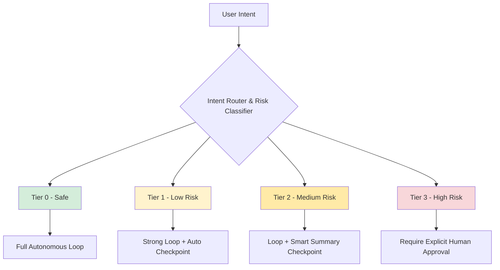
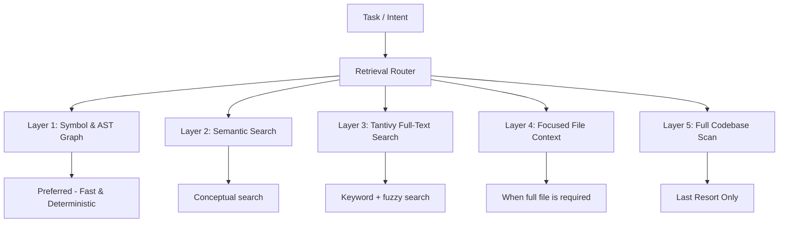

# Izen Architecture Refinement v2  
**Human-Controlled + Efficient + Realistic Agent Loop**

**Core Objective**:  
Build an AI coding agent that achieves **strong autonomy and efficiency** while maintaining **high safety and genuine human control** — without excessive interruptions.

> "Agent loops should be powerful, but safety and human oversight must always come first."

---

### 1. Core Philosophy (Refined)

Izen does not pursue full autonomy.  
Izen pursues **Controlled Autonomy** — where the agent can run strong, long loops within clearly defined safety boundaries set by the human.

The human remains the ultimate authority, but is not required to micromanage every step.

---

### 2. Risk Tier System (4 Tiers)

**Detailed Risk Tiers:**

| Tier | Name | Description | Loop Capability | Human Involvement | Security Level |
|------|------|-------------|-----------------|-------------------|---------------|
| **Tier 0** | Safe | Very small, non-sensitive changes | Full autonomous loop | Periodic summary only | Very High |
| **Tier 1** | Low Risk | Normal refactors, small features | Strong loop + auto checkpoint | Post-session review | High |
| **Tier 2** | Medium Risk | Important logic changes | Loop with Smart Summary Checkpoint | Quick approve / veto | Very High |
| **Tier 3** | High Risk | Auth, security, DB, permissions, network, crypto | Limited / paused loop | **Mandatory Human Approval** | Maximum |

---

### 3. Human Control Without Friction

- **Smart Summary Checkpoint**: Agent automatically sends concise summaries with risk highlights at logical intervals. User only needs to reply `ok`, `stop`, or `adjust`.
- **Emergency Veto**: One-click global stop/pause button available at all times.
- **Pre-declared Rules**: User can define persistent rules (e.g., "All Tier 0 & 1 changes in `src/ui/` are pre-approved").
- **Trust Score System**: Cleaner loops increase the agent’s autonomy in future sessions.

---

### 4. Security & Anti-Sophisticated Attack Layer

- **Multi-Layer Defense**:
  1. Risk Tier Classifier
  2. Static Security Scanner (run before any patch is applied)
  3. Second LLM Review (different model reviews AI-generated code)
  4. Code Provenance Tracking (all AI-generated code is clearly tagged)
  5. Strict Scope Guard (prevent changes outside approved scope)

- **Defense against subtle malicious code**:
  - Automatic detection of dangerous patterns (hardcoded secrets, unsafe eval, permission escalation, etc.).
  - Highlight sensitive changes in diffs.
  - All high-risk changes require Tier 3 approval.

---

### 5. Efficient Retrieval & Context Management

To avoid wasting tokens reading the entire codebase:

- **Hierarchical Retrieval** (cheap → expensive):
  1. **Symbol & AST Graph** (preferred)
  2. Semantic Search
  3. Focused File Context
  4. Full Codebase Scan (last resort only)

- Every step enforces a **Context Budget**. Unnecessary full-file reads are rejected.

---

### 6. Failure Handling (New Section)

**Failure Classification & Recovery Policy:**

| Failure Class | Examples | Recovery Strategy | Human Involvement |
|---------------|----------|-------------------|-------------------|
| `CODE_FAILURE` | Syntax, type, compilation errors | Bounded auto-repair (max 2 attempts) | Post-review |
| `ENVIRONMENT_FAILURE` | Missing deps, service down | Investigation mode | Notify if persistent |
| `TEST_FAILURE` | Broken assertions, spec changes | Return to Planning | Human review recommended |
| `SCOPE_FAILURE` | Unauthorized changes | Immediate rollback | Mandatory notification |
| `SECURITY_ISSUE` | Dangerous pattern detected | Immediate rollback + block | **Mandatory Human Review** |
| `UNKNOWN` | Cannot classify confidently | **Stop & Escalate** | Human takes control |

**Key Rule**:  
`UNKNOWN` failures **must stop the loop**. The agent is not allowed to guess recovery for unknown failures.

---

### 7. Efficient Code Retrieval & Precise Editing System

One of the biggest challenges for coding agents working on large codebases is **retrieving the right files and editing the correct locations** without wasting tokens or hallucinating changes in wrong places.

Izen solves this with a **Hierarchical Retrieval Architecture** that prioritizes precision, cost-efficiency, and transparency.

#### 7.1 Design Principles

- **Precision over Recall**: Better to retrieve fewer, highly relevant contexts than many noisy ones.
- **Cost Awareness**: Cheaper and more deterministic methods are always preferred.
- **Transparency**: The agent must declare what it intends to read and edit before execution.
- **Hybrid Search**: Combine symbolic, semantic, and full-text search for maximum effectiveness.

#### 7.2 Hierarchical Retrieval Layers

**Layer Details:**

| Layer | Method | Technology | When to Use | Cost | Accuracy | Priority |
|-------|--------|----------|-------------|------|----------|----------|
| **1** | Symbol & AST Graph | Tree-sitter + LSP | Function/class lookup | Very Low | Very High | **Highest** |
| **2** | Semantic Search | Embedding model + Vector DB | Conceptual search | Medium | High | High |
| **3** | Full-Text Search | **Tantivy (Rust)** | Keyword, fuzzy, complex queries | Low-Medium | Very High | High |
| **4** | Focused File Context | - | Need full implementation | Medium-High | Very High | Medium |
| **5** | Full Codebase Scan | - | Global refactoring | Very High | Medium | **Last Resort** |

#### 7.3 Why Tantivy?

**Tantivy** (a high-performance Rust search engine library) is integrated as Layer 3 because:
- Extremely fast indexing and querying.
- Excellent support for fuzzy search, phrase search, and custom scoring.
- Low memory footprint — ideal for large codebases.
- Can be combined with semantic search for hybrid results.

This combination (**mb25-style indexing + Tantivy + Semantic Search**) gives Izen a strong advantage in quickly finding relevant code across massive repositories.

#### 7.4 Retrieval Workflow

1. **Intent Analysis**
2. **Declarative Retrieval** — Agent must declare intended targets and reasoning.
3. **Layered Execution** — Start from Layer 1 → escalate only when necessary.
4. **Context Construction** — Build minimal, relevant context for the LLM.
5. **Validation** — Scope Guard + Human Audit Log.

#### 7.5 Editing Safeguards

- Exact edit locations must be declared with symbol or line references.
- All edits go through **Scope Guard**.
- Sensitive files automatically trigger higher tier approval.

