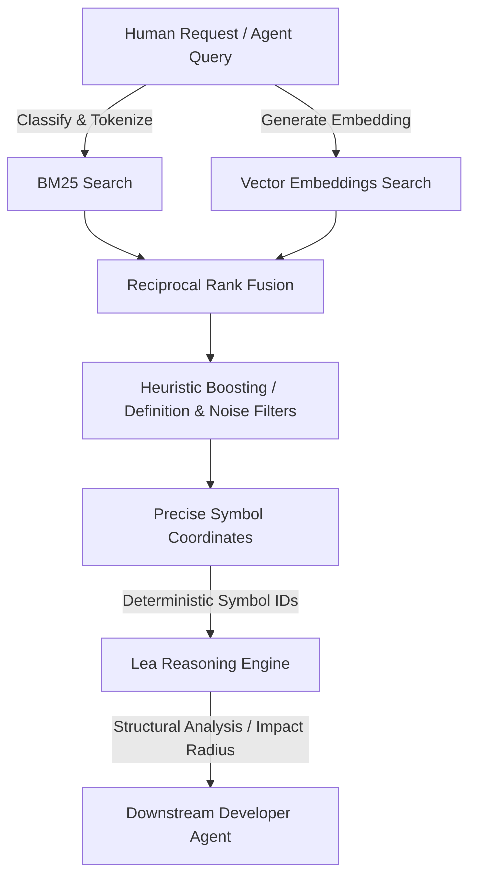

<div align="center">


# Lynx

### Symbol-first repository discovery engine for AI-native developer tooling.

**Lynx transforms developer intent into stable repository coordinates — symbols, files, and structural chunks — enabling downstream reasoning systems like Lea to operate on deterministic code primitives instead of fragile text spans.**

[](https://crates.io/crates/pizen-lynx)
[](https://docs.rs/pizen-lynx)
[](https://github.com/PizenLabs/lynx/actions)
[](./LICENSE)
[](https://github.com/PizenLabs/lynx/stargazers)

---

 **Lynx discovers. Lea reasons.**

[Features](#features) •
[Ecosystem & Architecture](#ecosystem--architecture) •
[Design Principles](#design-principles) •
[Installation](#installation) •
[CLI Usage](#cli-usage) •
[MCP Server](#mcp-server) •
[Repository Layout](#repository-layout) •
[Contributing](#contributing)

</div>

## Features

- **Symbol-first discovery** with stable, deterministic identifiers rather than fragile text snippets.
- **Multilingual Support**: Tree-sitter parsing for structured symbol extraction and syntax-aware chunking:
  - **Rust** (`.rs`)
  - **Go** (`.go`)
  - **TypeScript / TSX** (`.ts`, `.tsx`)
  - **JavaScript / JSX** (`.js`, `.jsx`)
  - **Python** (`.py`)
- **Hybrid Retrieval**: Integrates **BM25 lexical search** (via Tantivy) with **semantic vector search** (via FastEmbed utilizing `bge-small-en-v1.5`) using **Reciprocal Rank Fusion (RRF)** for optimal relevance.
- **Local-first, CPU-first**: Zero cloud or GPU dependencies. Operates entirely offline with high-performance local indexing.
- **Heuristic Signal Boosting**:
  - *Definition Boost*: Prioritizes symbol definitions over code references (1.5x score multiplier).
  - *Noise Suppression*: Filters and penalizes mock, test, generated, and vendor code automatically.
- **Integrations**: Supports a minimal stdio **Model Context Protocol (MCP) server** and integrates natively with the **Lea** reasoning layer.

---

## Ecosystem & Architecture

Lynx sits at the absolute beginning of the AI-native developer pipeline. It converts human queries or vague agent intents into exact coordinates in a repository, passing them off to reasoning engines like Lea for structural analysis.



---

## Design Principles

1. **Discovery Only**: Lynx does not perform reasoning, dependency analyses, or calculate impact radius. Its sole job is to answer: *"Where is this concept located?"*
2. **Speed First**: Cold queries execute in `< 100ms`, while cached or warm queries resolve in `< 10ms`.
3. **Token Efficiency**: Instead of dumping thousands of raw lines or dozens of files, Lynx provides the minimal, precise coordinates (symbol ranges, file coordinates) needed.
4. **Deterministic Base**: Bypasses ranking completely for exact symbol lookups (`O(1)` complexity) to guarantee repeatability.

---

## Installation

Install the CLI directly from crates.io:

```bash
cargo install pizen-lynx
```

The CLI installs under the binary name **`lx`**.

---

## CLI Usage

Configure storage paths globally using the `-s` or `--storage-path` flag (defaults to `.lynx` in the current project root).

### 1. Indexing a Repository
Generate the semantic and symbol index for the repository:
```bash
lx index /path/to/repo
```
*Note: Test, mock, and generated files are skipped by default. To include them, pass the `--include-tests` flag:*
```bash
lx index /path/to/repo --include-tests
```

### 2. Conceptual Search
Search your indexed codebase using lexical and semantic hybrid querying:
```bash
lx search "jwt validation token"
```
*Include test and generated code in search results:*
```bash
lx search "jwt validation token" --include-tests
```

### 3. Symbol Resolution
Resolve an exact symbol's coordinates bypassing rank-fusion:
```bash
lx resolve Login
```

### 4. Code Proximity & Related Items
Find related implementations and references close to a specific line:
```bash
lx related internal/auth/service.go:42
```

### 5. Control Flow Visualization (with Lea)
Query a conceptual flow and visualize its downstream control path by triggering Lea automatically:
```bash
lx flow "user validation handler"
```

### 6. Storage Customization
Change the default directory for index and caching files:
```bash
lx --storage-path /tmp/lynx index .
```

---

## MCP Server

Lynx includes a built-in **Model Context Protocol (MCP)** server communicating over standard input/output (stdio). This allows LLMs and AI agents (like Claude Desktop) to discover files and symbols natively.

### Running the Server
You can launch the server directly from the CLI:
```bash
lx mcp
```
Or run the workspace binary directly:
```bash
cargo run -p lynx-mcp -- .lynx
```

### Supported MCP Tools

#### 1. `search`
Hybrid natural-language and keyword search across chunks.
- **Arguments**: `query` (string)
- **JSON-RPC payload**:
  ```json
  {"jsonrpc":"2.0", "id": 1, "method": "search", "params": {"query": "authentication flow"}}
  ```

#### 2. `resolve_symbol`
Instant coordinate resolution for an exact symbol name.
- **Arguments**: `name` (string)
- **JSON-RPC payload**:
  ```json
  {"jsonrpc":"2.0", "id": 2, "method": "resolve_symbol", "params": {"name": "Login"}}
  ```

#### 3. `find_related`
Retrieves implementation chunks matching or close to a coordinate.
- **Arguments**: `file` (string), `line` (number)
- **JSON-RPC payload**:
  ```json
  {"jsonrpc":"2.0", "id": 3, "method": "find_related", "params": {"file": "internal/auth/service.go", "line": 42}}
  ```

---

## Repository Layout

```
crates/
  lynx-cli/       # CLI tool and subcommand handler (crate: pizen-lynx)
  lynx-common/    # Shared utilities and core workspace structures (crate: pizen-lynx-common)
  lynx-core/      # RRF pipeline, classification, indexing, and ranking (crate: pizen-lynx-core)
  lynx-embed/     # Embedding abstraction and local FastEmbed provider (crate: pizen-lynx-embed)
  lynx-mcp/       # Standalone MCP server over stdio (crate: pizen-lynx-mcp)
  lynx-parser/    # Syntax parsing and Tree-sitter symbol extraction (crate: pizen-lynx-parser)
  lynx-protocol/  # Shared serializable serialization protocols (crate: pizen-lynx-protocol)
  lynx-storage/   # Tantivy lexical indexing & embedding persistence (crate: pizen-lynx-storage)
```

---

## Contributing

We welcome issues and pull requests! Ensure all formatters, lints, and tests pass successfully before submitting changes:

```bash
make ci
```

---

## License

MIT

